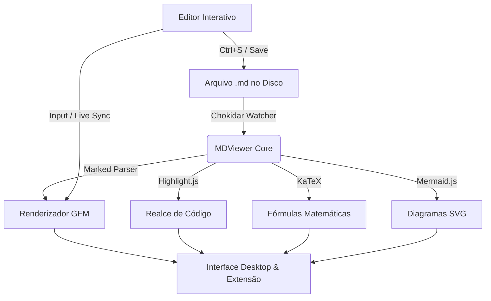
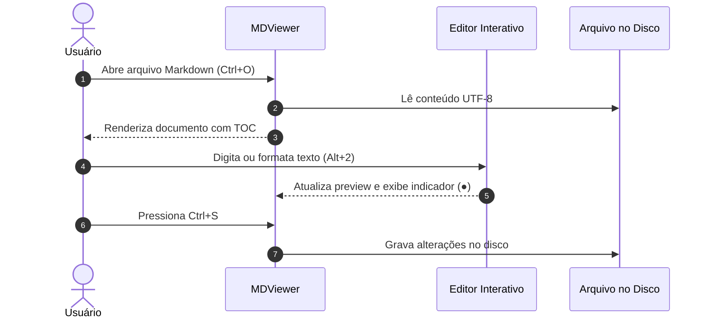

# 🚀 Bem-vindo ao MDViewer

O **MDViewer** é um aplicativo multiplataforma rápido, moderno e completo para visualização e **edição interativa** de documentos **Markdown** no Linux, Windows 11 e Google Chrome.

---

## 📑 Recursos Principais

- ✏️ **Editor Markdown Interativo**: Alterne entre Visualização (`Alt+1`), Modo Dividido (`Alt+2`) e Edição pura (`Alt+3`).
- 🛠️ **Barra de Ferramentas Visual**: Formatação rápida com 1 clique para negrito, itálico, cabeçalhos, tabelas, links, imagens e blocos de código.
- ⚡ **GitHub Flavored Markdown (GFM)** nativo (Tabelas, Listas de Tarefas, Links e Imagens).
- 🎨 **7 Temas Visuais** (GitHub Dark, GitHub Light, Dracula, Nord, One Dark, Sépia, Monokai).
- 📊 **Diagramas Mermaid Interativos** renderizados em tempo real.
- 🧮 **Fórmulas Matemáticas LaTeX** com KaTeX ($E = mc^2$).
- 💡 **Alertas e Callouts GitHub** (`[!NOTE]`, `[!TIP]`, `[!WARNING]`, etc.).
- 💻 **Realce de Sintaxe** com mais de 100 linguagens e botão de cópia rápida.
- 🔄 **Live Sync / Auto-Reload**: detecção instantânea de alterações no disco via Chokidar.
- 📑 **Múltiplas Abas** e **Explorador de Pastas / Índice (TOC)** lateral.
- 🔍 **Localizador no Documento** (`Ctrl+F`) com navegação rápida.
- 🖨️ **Exportação** para PDF e HTML autocontido.

---

## 💡 GitHub Callouts / Alertas

> [!NOTE]
> Este é um alerta informativo de **Nota**. Útil para contextualizar observações no documento.

> [!TIP]
> **Dica**: Use o atalho `Alt + 2` para abrir o **Modo Dividido (Split)** com editor à esquerda e preview à direita. Use `Ctrl + S` para salvar suas alterações!

> [!IMPORTANT]
> O MDViewer monitora automaticamente o arquivo aberto. Qualquer alteração feita por outros editores (como Vim, Nano, VS Code) é atualizada imediatamente. Ao editar diretamente no MDViewer, as alterações são salvas manualmente com total controle seu.

> [!WARNING]
> Certifique-se de salvar seus arquivos com codificação UTF-8 para compatibilidade perfeita com caracteres especiais e emojis.

> [!CAUTION]
> Ao fechar uma aba com alterações não salvas (`●`), o MDViewer solicitará confirmação para que você não perca seu trabalho.

---

## 📊 Diagramas Mermaid

O MDViewer suporta diagramas Mermaid diretamente nos blocos de código.

### Fluxograma de Arquitetura



### Diagrama de Sequência



---

## 🧮 Fórmulas Matemáticas (KaTeX)

O MDViewer suporta fórmulas matemáticas em linha como $f(x) = ax^2 + bx + c$ ou a Identidade de Euler $e^{i\pi} + 1 = 0$.

Também suporta blocos matemáticos destacados com `$$ ... $$`:

$$
x = \frac{-b \pm \sqrt{b^2 - 4ac}}{2a}
$$

Equação de Schrödinger dependente do tempo:

$$
i\hbar \frac{\partial}{\partial t}\Psi(\mathbf{r},t) = \left[ -\frac{\hbar^2}{2m}\nabla^2 + V(\mathbf{r},t)\right]\Psi(\mathbf{r},t)
$$

---

## 💻 Realce de Código e Sintaxe

### Python

```python
import os
from pathlib import Path

def listar_arquivos_markdown(diretorio: str) -> list[Path]:
    """Retorna todos os arquivos .md encontrados na pasta."""
    caminho = Path(diretorio)
    return sorted(caminho.glob("**/*.md"))

if __name__ == "__main__":
    pasta = os.path.expanduser("~/Documentos")
    arquivos = listar_arquivos_markdown(pasta)
    print(f"Encontrados {len(arquivos)} arquivos Markdown.")
```

### JavaScript / Node.js

```javascript
const { app, BrowserWindow } = require('electron');

function createWindow() {
  const win = new BrowserWindow({
    width: 1200,
    height: 800,
    webPreferences: {
      nodeIntegration: false,
      contextIsolation: true
    }
  });

  win.loadFile('index.html');
}

app.whenReady().then(createWindow);
```

### Rust

```rust
fn fibonacci(n: u64) -> u64 {
    match n {
        0 => 0,
        1 => 1,
        _ => fibonacci(n - 1) + fibonacci(n - 2),
    }
}

fn main() {
    let termos: Vec<u64> = (0..10).map(fibonacci).collect();
    println!("Fibonacci: {:?}", termos);
}
```

---

## 📋 Tabelas e Listas de Tarefas

### Tabela de Recursos e Plataformas

| Recurso | Desktop Linux | Desktop Windows 11 | Extensão Chrome |
| :--- | :---: | :---: | :---: |
| **Editor Interativo** | ✅ Sim | ✅ Sim | ✅ Sim |
| **Barra de Ferramentas**| ✅ Sim | ✅ Sim | ✅ Sim |
| **Diagramas Mermaid** | ✅ Sim | ✅ Sim | ✅ Sim |
| **Fórmulas KaTeX** | ✅ Sim | ✅ Sim | ✅ Sim |
| **Live Sync / Auto-Reload** | ✅ Sim | ✅ Sim | ⚠️ Sob demanda |
| **Exportação PDF / HTML** | ✅ Sim | ✅ Sim | ✅ Sim (Print) |
| **Árvore de Arquivos** | ✅ Sim | ✅ Sim | ✅ Sim |
| **7 Temas Visuais** | ✅ Sim | ✅ Sim | ✅ Sim |

### Checklist Interativa de Tarefas
*(Experimente clicar nas caixas de seleção abaixo diretamente na área de visualização!)*

- [x] Desenvolver o núcleo do visualizador com Electron
- [x] Implementar motor de renderização GFM completo
- [x] Adicionar suporte a fórmulas KaTeX e diagramas Mermaid
- [x] Integrar monitor de arquivos Chokidar para live-reload
- [x] Implementar Editor Markdown Interativo com Barra de Ferramentas
- [x] Criar pacote executável para Windows 11 e Extensão para o Chrome
- [ ] Criar novos documentos e explorar o MDViewer!

---

## ⌨️ Principais Atalhos de Teclado

| Atalho | Ação |
| :--- | :--- |
| `Ctrl + N` | Novo Arquivo |
| `Ctrl + S` | Salvar Arquivo |
| `Ctrl + Shift + S` | Salvar Como... |
| `Ctrl + O` | Abrir Arquivo |
| `Ctrl + Shift + O` | Abrir Pasta no Explorador |
| `Ctrl + W` | Fechar Aba Atual |
| `Ctrl + R` | Recarregar Arquivo |
| `Ctrl + F` | Localizar Texto no Documento |
| `Ctrl + P` | Imprimir / Exportar para PDF |
| `Ctrl + B` | Negrito no Editor / Alternar Barra Lateral |
| `Ctrl + I` | Itálico no Editor |
| `Ctrl + K` | Inserir Link no Editor |
| `Tab` / `Shift + Tab`| Indentar / Desindentar no Editor |
| `Alt + 1` | Modo Visualização (Preview) |
| `Alt + 2` | Modo Dividido (Split) |
| `Alt + 3` | Modo Código Fonte (Editor) |
| `Ctrl + + / - / 0` | Aumentar / Diminuir / Resetar Zoom |
| `F1` | Painel de Atalhos |
| `F11` | Tela Cheia |

---

*Aproveite a experiência com o MDViewer!*
